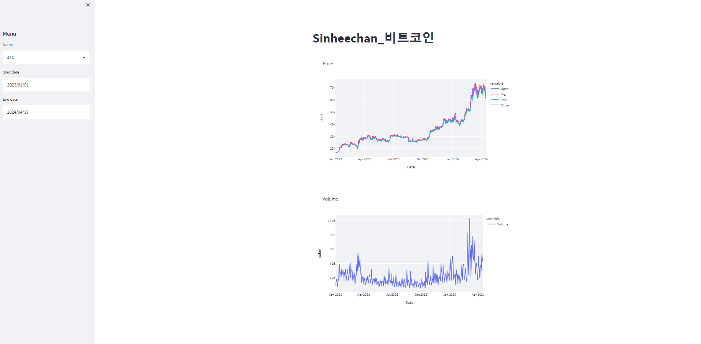

# Porject_streamlit_Webapp

- Streamlit을 통한 다양한 웹 서비스 구축

   

  

   
## Object

Streamlit은 파이썬 스크립트로 데이터를 시각화하고 웹 애플리케이션을 생성할 수 있다.

본 프로젝트에서는 해당 도구를 활용하여 웹 서비스 구축 모델 생성을 목표로 한다.

1. Mnist 손글씨 분류 및 시각화 웹 애플리케이션
2. 비트코인의 가격 및 거래량 시각화 웹 애플리케이션

   
## Dataset
- 

   
## Libraries used

   
## File explanation

   
## Version

**[mnist.py]**
- python 3.6
- streamlit 1.10.0
- streamlit-drawable-canvas 0.5.1
- opencv-python 4.5.3.56

**[server.py]**
- Python 3.11.0
- Flask 2.3.0

   
## Result

