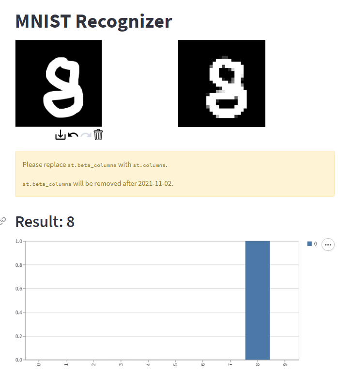

# Porject_streamlit_Webapp

   

   
## Object

   
## Dataset
-

   
## Libraries used

   
## File explanation

   
## Version

**[mnist.py]**
- python 3.6
- streamlit 1.10.0
- streamlit-drawable-canvas 0.5.1
- opencv-python 4.5.3.56

**[server.py]**
- Python 3.11.0
- Flask 2.3.0

   
## Result

